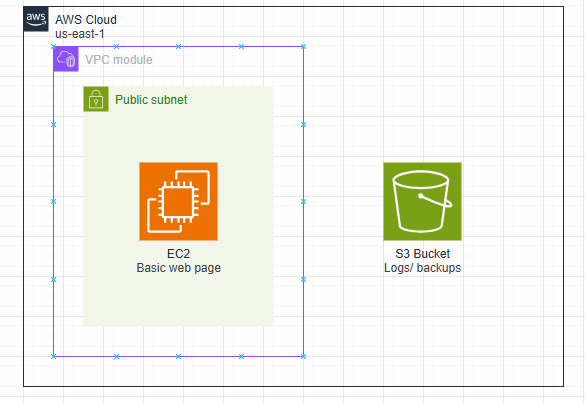
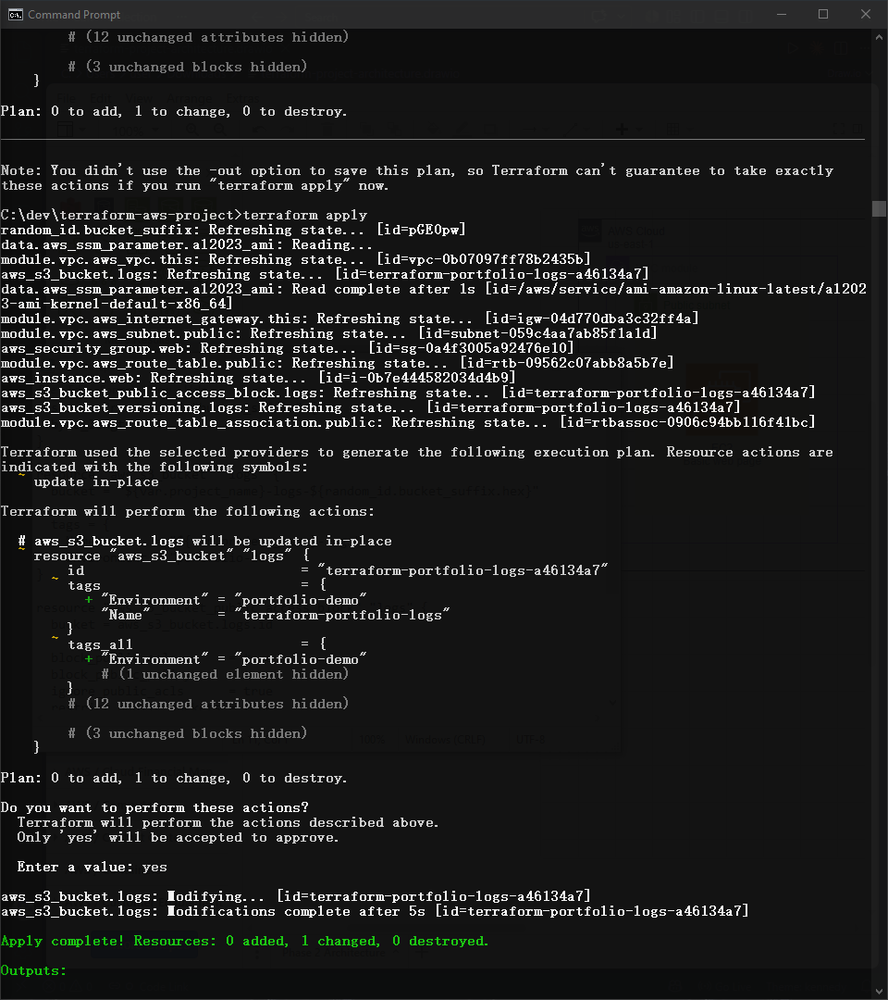
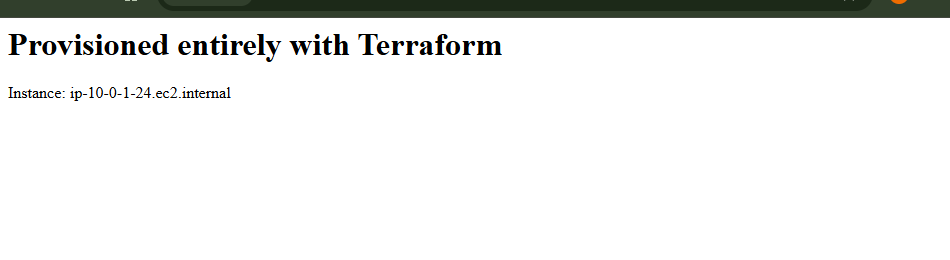
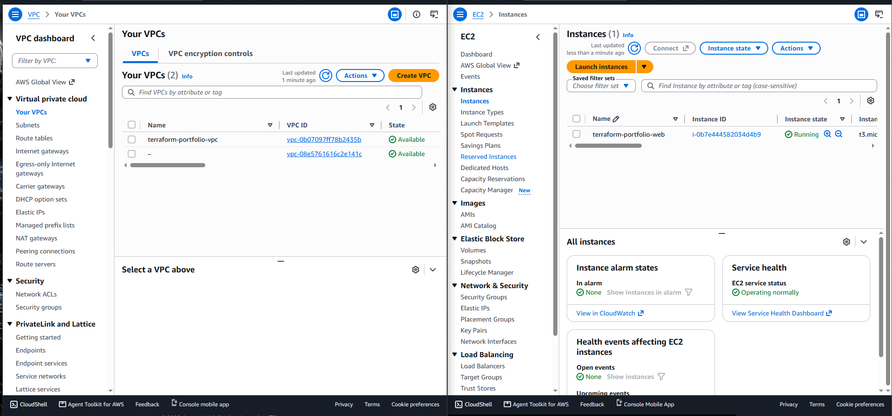
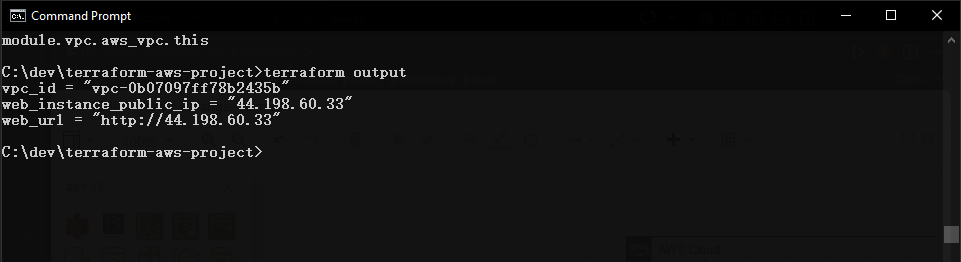
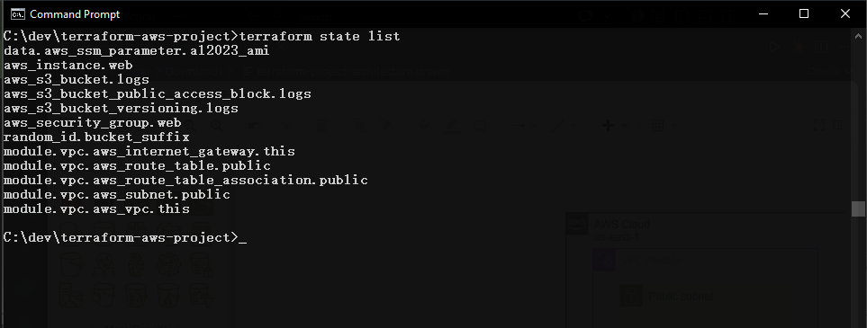
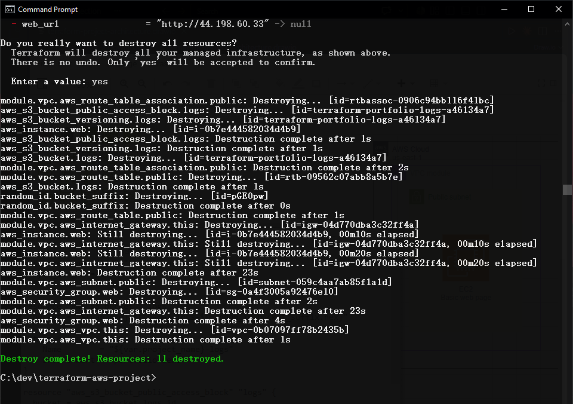

# AWS Infrastructure as Code with Terraform

A modular Terraform project provisioning real AWS infrastructure - VPC, EC2 web server, S3 bucket - with the full lifecycle proven: create, verify, modify in-place, and safely destroy. Built as a deliberately smaller, focused project to properly learn Terraform mechanics (state, modules, dependency graphs) rather than re-implementing prior projects' complexity in a new syntax.

## What This Demonstrates
- Proper Terraform project structure - a reusable child module (VPC) alongside root-level resources, not a single monolithic file
- Terraform's automatic dependency graph - resource creation *and* destruction ordering handled entirely by Terraform, without manually sequencing commands (a direct contrast to Projects 1 and 2, where every creation/teardown order had to be figured out and executed by hand)
- Variables and `.tfvars` for reusable, environment-independent code - no hardcoded values
- Data sources (`aws_ssm_parameter`) for dynamic values instead of hardcoded AMI IDs
- The full safe lifecycle: `plan` → `apply` → `plan` (modify) → `apply` (modify) → `plan -destroy` → `destroy`, each step reviewed before executing
- Multi-provider usage (`hashicorp/aws` + `hashicorp/random`) in a single project

## Architecture

**Structure:** VPC module (VPC, public subnet, Internet Gateway, route table) → EC2 web server + security group (root-level) → S3 logging bucket (root-level, independent resource)

## Project Structure
terraform-aws-project/
├── main.tf # Provider + Terraform version requirements
├── variables.tf # Root-level input variables
├── outputs.tf # Exposed values (VPC ID, public IP, URL)
├── vpc.tf # Calls the VPC module
├── ec2.tf # Security group + EC2 instance + AMI data source
├── s3.tf # S3 bucket + versioning + public access block
├── terraform.tfvars # Local values (gitignored - contains my IP)
└── modules/
└── vpc/
├── main.tf # VPC, subnet, IGW, route table resources
├── variables.tf # Module's required inputs (no defaults - caller must supply)
└── outputs.tf # vpc_id, public_subnet_id exposed to root

## Design Decisions

| Decision | Why |
|---|---|
| Terraform over CloudFormation/CDK | Cloud-agnostic, largest ecosystem, most commonly requested IaC skill |
| Local state (for now) | Simplest way to learn what state actually is before adding remote-state complexity; documented as a future improvement |
| VPC as a proper child module | Demonstrates real code reuse, not just file organization - module has its own required inputs and explicit outputs, no hidden defaults |
| Every environment-specific value as a variable | The actual point of IaC - code that's reusable without editing, not just automation of one-off manual steps |
| `.tfvars` for the IP address, gitignored | Environment-specific and mildly identifying - kept out of version control while the `.tf` files referencing it stay safely shareable |

## Evidence

**`terraform plan` before applying - dry run, zero changes made yet:**

**The web server, live, provisioned entirely from code:**

**AWS Console confirming the resources genuinely exist - not just claimed in Terraform state:**

**`terraform output` - the three defined outputs, populated with real values:**

**`terraform state list` - all resources Terraform is tracking, in one place:**

**The modify workflow - adding a tag to the S3 bucket as an in-place update (`~`, not destroy-and-recreate), followed by the full destroy - reverse-dependency order handled entirely automatically, VPC destroyed last:**

## Testing / Proof of Work
| Test | Method | Result |
|---|---|---|
| Initial provisioning | `terraform apply` | ✅ 12 resources created, verified in AWS Console |
| Reproducibility check | `terraform plan` after apply | ✅ "No changes" — state matches real infrastructure exactly |
| Safe modification | Added a tag, `terraform plan` then `apply` | ✅ Correctly identified as in-place update (`~`), not destroy/recreate |
| Full teardown | `terraform plan -destroy` then `terraform destroy` | ✅ All resources removed in correct reverse-dependency order, confirmed empty via AWS CLI afterward |
| Web server functionality | Loaded public IP in browser | ✅ Page rendered correctly, confirming EC2 + security group + user_data all worked together |

## Troubleshooting Notes (real issues hit during this build)
- **OneDrive-synced folders can silently stall large file operations.** The AWS provider plugin is ~900MB - running `terraform init` inside a OneDrive-synced directory caused the download/install step to hang indefinitely with no error, seemingly due to OneDrive holding a file lock during sync. Moving the project to a non-synced local path (`C:\dev\...`) resolved it immediately. Worth checking early if `terraform init` seems stuck with no progress or error.
- **An empty file saved silently, causing a subtle version mismatch.** `main.tf` was accidentally saved empty in Notepad; since it contained the `required_providers` version constraint, Terraform had nothing to constrain against and pulled the latest major provider version (v6) instead of the intended v5.x. Caught by comparing the "Installing hashicorp/aws vX.X.X" line against what was actually specified in the file.
- **A missing closing brace produced a clear, specific parse error** ("Unclosed configuration block") pointing to the exact line - Terraform's error messages for HCL syntax issues are generally precise enough to fix quickly by re-reading the file directly (`type <file>`) rather than guessing.

## Cost Considerations
- All resources used are Free Tier eligible (`t3.micro`, minimal S3 storage) - negligible cost even if left running briefly
- **Fully destroyed after evidence collection** - confirmed via `terraform state list` (empty) and direct AWS CLI checks (`describe-vpcs`, `s3 ls`) after `terraform destroy`
- Terraform's `destroy` command is itself a meaningful cost-safety feature -one command reliably removes everything tracked in state, removing the risk of manually forgetting a resource during teardown (a real risk in Projects 1–3's manual CLI teardowns)

## Future Improvements
- **Remote state** - migrate from local `terraform.tfstate` to an S3 backend with DynamoDB state locking, enabling safe team collaboration and removing the single-point-of-failure risk of a local state file
- **Workspaces or separate `.tfvars` files** for multiple environments (dev/staging/prod) from the same codebase
- **CI/CD integration** - run `terraform plan` automatically on pull requests, `apply` only after review/merge
- Commit `.terraform.lock.hcl` in a real team setting (excluded here since this is a single-maintainer portfolio repo where fresh `init` is expected)
