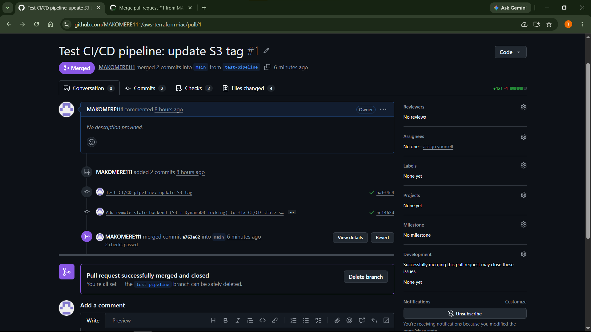
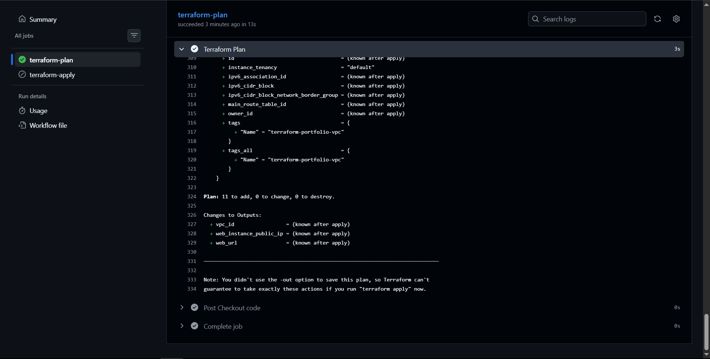
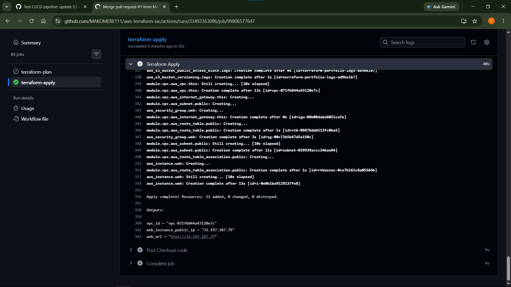
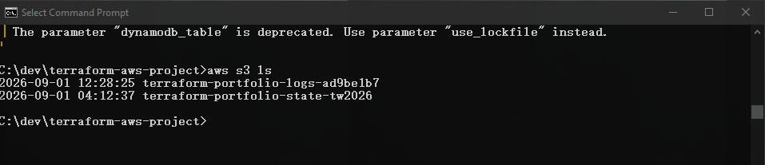
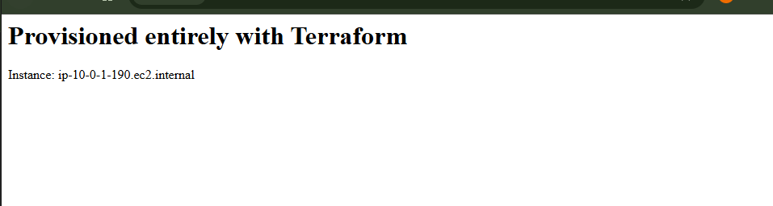

# AWS Infrastructure as Code with Terraform

A modular Terraform project provisioning real AWS infrastructure - VPC, EC2 web server, S3 bucket - with the full lifecycle proven: create, verify, modify in-place, and safely destroy. Built as a deliberately smaller, focused project to properly learn Terraform mechanics (state, modules, dependency graphs) rather than re-implementing prior projects' complexity in a new syntax.

## What This Demonstrates
- Proper Terraform project structure - a reusable child module (VPC) alongside root-level resources, not a single monolithic file
- Terraform's automatic dependency graph - resource creation *and* destruction ordering handled entirely by Terraform, without manually sequencing commands (a direct contrast to Projects 1 and 2, where every creation/teardown order had to be figured out and executed by hand)
- Variables and `.tfvars` for reusable, environment-independent code - no hardcoded values
- Data sources (`aws_ssm_parameter`) for dynamic values instead of hardcoded AMI IDs
- The full safe lifecycle: `plan` → `apply` → `plan` (modify) → `apply` (modify) → `plan -destroy` → `destroy`, each step reviewed before executing
- Multi-provider usage (`hashicorp/aws` + `hashicorp/random`) in a single project

## Architecture


**Structure:** VPC module (VPC, public subnet, Internet Gateway, route table) → EC2 web server + security group (root-level) → S3 logging bucket (root-level, independent resource)

## Project Structure

```
terraform-aws-project/
├── main.tf              # Provider + Terraform version requirements
├── variables.tf         # Root-level input variables
├── outputs.tf           # Exposed values (VPC ID, public IP, URL)
├── vpc.tf               # Calls the VPC module
├── ec2.tf                # Security group + EC2 instance + AMI data source
├── s3.tf                 # S3 bucket + versioning + public access block
├── terraform.tfvars     # Local values (gitignored — contains my IP)
└── modules/
    └── vpc/
        ├── main.tf       # VPC, subnet, IGW, route table resources
        ├── variables.tf  # Module's required inputs (no defaults — caller must supply)
        └── outputs.tf    # vpc_id, public_subnet_id exposed to root
```

## Evidence

**`terraform plan` before applying - dry run, zero changes made yet:**


**The web server, live, provisioned entirely from code:**


**AWS Console confirming the resources genuinely exist - not just claimed in Terraform state:**


**`terraform output` - the three defined outputs, populated with real values:**


**`terraform state list` - all resources Terraform is tracking, in one place:**


**The modify workflow - adding a tag to the S3 bucket as an in-place update (`~`, not destroy-and-recreate), followed by the full destroy - reverse-dependency order handled entirely automatically, VPC destroyed last:**


## Testing / Proof of Work
| Test | Method | Result |
|---|---|---|
| Initial provisioning | `terraform apply` | ✅ 12 resources created, verified in AWS Console |
| Reproducibility check | `terraform plan` after apply | ✅ "No changes" - state matches real infrastructure exactly |
| Safe modification | Added a tag, `terraform plan` then `apply` | ✅ Correctly identified as in-place update (`~`), not destroy/recreate |
| Full teardown | `terraform plan -destroy` then `terraform destroy` | ✅ All resources removed in correct reverse-dependency order, confirmed empty via AWS CLI afterward |
| Web server functionality | Loaded public IP in browser | ✅ Page rendered correctly, confirming EC2 + security group + user_data all worked together |

## Troubleshooting Notes (real issues hit during this build)
- **OneDrive-synced folders can silently stall large file operations.** The AWS provider plugin is ~900MB - running `terraform init` inside a OneDrive-synced directory caused the download/install step to hang indefinitely with no error, seemingly due to OneDrive holding a file lock during sync. Moving the project to a non-synced local path (`C:\dev\...`) resolved it immediately. Worth checking early if `terraform init` seems stuck with no progress or error.
- **An empty file saved silently, causing a subtle version mismatch.** `main.tf` was accidentally saved empty in Notepad; since it contained the `required_providers` version constraint, Terraform had nothing to constrain against and pulled the latest major provider version (v6) instead of the intended v5.x. Caught by comparing the "Installing hashicorp/aws vX.X.X" line against what was actually specified in the file.
- **A missing closing brace produced a clear, specific parse error** ("Unclosed configuration block") pointing to the exact line - Terraform's error messages for HCL syntax issues are generally precise enough to fix quickly by re-reading the file directly (`type <file>`) rather than guessing.

## Cost Considerations
- All resources used are Free Tier eligible (`t3.micro`, minimal S3 storage) - negligible cost even if left running briefly
- **Fully destroyed after evidence collection** - confirmed via `terraform state list` (empty) and direct AWS CLI checks (`describe-vpcs`, `s3 ls`) after `terraform destroy`
- Terraform's `destroy` command is itself a meaningful cost-safety feature -one command reliably removes everything tracked in state, removing the risk of manually forgetting a resource during teardown (a real risk in Projects 1–3's manual CLI teardowns)

## CI/CD Pipeline (GitHub Actions)

This same Terraform codebase is also deployed via an automated pipeline - no manual `terraform apply` from a laptop required. The workflow lives at [`.github/workflows/terraform.yml`](.github/workflows/terraform.yml).

**How it works:**
- **On every pull request into `main`:** a `terraform-plan` job runs automatically - checks out the code, initializes Terraform, and runs `terraform plan`, so the exact changes are visible for review before anything touches real AWS.
- **On merge to `main`:** a separate `terraform-apply` job runs automatically - same setup, but runs `terraform apply -auto-approve`, deploying the reviewed changes for real.
- These are deliberately two separate jobs with different trigger conditions, not one - this is the actual safety mechanism: nothing is ever applied to AWS without first passing through a human-reviewed pull request.

**Remote state - a real problem hit and fixed, not just configured upfront:**
The first pipeline run revealed a genuine issue: Terraform's local state file (`terraform.tfstate`) only ever existed on my laptop, correctly excluded from git via `.gitignore`. The GitHub Actions runner had no access to it, so its first `plan` showed "11 to add" — ready to create a second, duplicate copy of everything, with no knowledge that resources might already exist. This is exactly the risk local state creates in any multi-environment or team context. Fixed by migrating to a **remote backend**: an S3 bucket (versioned, encrypted, public access blocked) for the state file itself, plus a DynamoDB table for state locking (preventing two concurrent `apply` runs from corrupting each other's changes). After migrating, `terraform init` on the pipeline and on my laptop both now read/write the exact same state — genuinely shared, not just locally assumed to be in sync.

**Credential handling:**
- AWS credentials are stored as encrypted **GitHub Secrets** (`AWS_ACCESS_KEY_ID`, `AWS_SECRET_ACCESS_KEY`, `AWS_REGION`), referenced by the workflow but never visible in code or logs.
- The IAM user powering this pipeline is scoped to only what this Terraform codebase actually needs (EC2, S3, specific IAM actions for the instance role, SSM parameter read, plus explicit access to the state bucket/lock table) - not `AdministratorAccess`.
- **A real credential-hygiene incident, disclosed honestly:** an AWS secret access key was briefly exposed in plaintext outside its intended secure storage during setup. It was rotated immediately (old key deleted, new key generated) before ever being used in the pipeline. Worth stating plainly here rather than omitting: mistakes like this happen, and the correct response is immediate rotation, not silence.
- **Documented future improvement:** migrate from long-lived access keys to **OIDC** (OpenID Connect) - where GitHub Actions requests short-lived, auto-expiring credentials directly from AWS via a trust relationship, with no stored AWS secret at all. This is the stronger, modern-standard pattern; access keys were used here first specifically to learn core CI/CD mechanics without also introducing IAM federation complexity in the same step.

### Evidence

**Pull request merged after the automated plan check passed - the human review gate in action:**


**The automated `terraform plan` job output, triggered by opening the PR:**


**The automated `terraform apply` job output, triggered by merging to `main` - 11 resources created with zero manual commands:**


**Remote state confirmed - a real `terraform.tfstate` object now lives in S3, shared between the pipeline and local development:**


**The pipeline-deployed application, live and working:**


### Testing / Proof of Work (CI/CD-specific)
| Test | Method | Result |
|---|---|---|
| Plan-on-PR trigger | Opened a PR with a small change | ✅ `terraform-plan` job ran automatically, posted plan output |
| Apply-on-merge trigger | Merged the PR | ✅ `terraform-apply` job ran automatically, created real infrastructure |
| Remote state sharing | Ran `terraform output` locally after a pipeline apply | ✅ Local Terraform correctly read the state the pipeline wrote |
| State locking | Observed `Acquiring state lock` / `Releasing state lock` in plan output | ✅ DynamoDB locking confirmed functioning, not just configured |
| Credential security | Reviewed workflow file and GitHub Secrets settings | ✅ No credentials in code; secrets masked in all logs |

### Troubleshooting Notes - CI/CD Specific
- **Local state doesn't exist for a CI runner.** The most important lesson of this project: a `.gitignore`'d local state file works fine for solo CLI use but is fundamentally incompatible with any automated pipeline, since the runner starts with zero knowledge of what already exists. Remote state isn't a "nice to have" for CI/CD — it's a hard requirement.
- **A GitHub PR and a GitHub Actions workflow run are different things to navigate.** Pushing additional commits to an existing PR's branch re-triggers checks on that same PR — no new PR is created or needed.
- **Editing a JSON IAM policy file by hand risks accidentally replacing content instead of appending to it** - worth verifying a policy file's full contents (`type <file>`) before submitting it, especially after a copy-paste edit.

## Future Improvements
- **Remote state** - migrate from local `terraform.tfstate` to an S3 backend with DynamoDB state locking, enabling safe team collaboration and removing the single-point-of-failure risk of a local state file
- **Workspaces or separate `.tfvars` files** for multiple environments (dev/staging/prod) from the same codebase
- ~~CI/CD integration~~ - **done**, see the [CI/CD Pipeline](#cicd-pipeline-github-actions) section below
- Commit `.terraform.lock.hcl` in a real team setting (excluded here since this is a single-maintainer portfolio repo where fresh `init` is expected)

